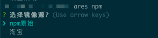
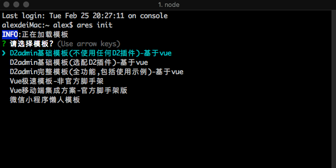

# 介绍 (💦开发中)


  

Ares是一个简单的脚手架,主要是为了解决每次创建项目时都要copy代码，配置插件等繁琐的工作。<br>
提供了一些开箱即用的模板（持续更新，不限于前端，**热烈欢迎提供大家写好的现成模板**）。

 - 📦 开箱即用的模板
 - 🚗 部分模板提供一些懒人命令
 - 🚀 GUI可视化操作 ❌ 开发中
 - 📖 一些常用插件和npm的整理和收集 提供一键安装的命令 ❌ 开发中

:neckbeard:会在网上收集一些好用的插件或者包并注明用途,然后提供快速安装。<br>
:alien:会集成一些方便的小功能:
- 切换npm镜像源
- node版本管理


## 安装

直接执行下面的命令,安装缓慢的可以切换淘宝镜像源

```shell
npm install @magic-zhu/ares -g
```

## 模板列表

模板编号 | 模板名称| 简介 | 说明文档 
|:---:|---|---|---
0| ✅D2admin基础模板(不使用任何D2插件)-基于vue|超级好用和漂亮的后台模板|https://gitee.com/fairyever/d2-admin
1| ❌D2admin基础模板(选配D2插件)-基于vue|开发中|https://gitee.com/fairyever/d2-admin
2| ✅D2admin完整模板(全功能,包括使用示例)-基于vue|有很多很棒的功能，无需二次开发|https://gitee.com/fairyever/d2-admin
3| ❌Vue极速模板-非官方脚手架|纯净快速的模板(适合小项目)|
4| ❌Vue移动端集成方案-官方脚手架版| vue移动端纯净基础模版|
5| 💦原生小程序开发模板| 简洁的原生小程序开发模板(👉支持cli命令<a href='#weapp'>跳转</a>)|
6| ❌React纯净模板|纯净的react模板只集成了请求封装和路由--开发中|
7| ❌flutter项目开发模板(待定)|

## 插件列表

插件编号 | 插件名称 | 简介 | 文档 | 作者 | 仓库地址
---|---|---|---|---|---|

## 使用

### 🚀 小工具部分

`切换npm镜像源`
```shell
ares npm
```


`切换node版本`
>集成tj大神的n - :exclamation:不支持windows(待更新后会集成windows)

+ `ares node lsr`:显示所有可安装的node版本
+ `ares node ls`:显示所有已安装的node版本
+ `ares node install <version>`:不带版本的时候安装最新稳定版本的node,带版本的时候安装指定版本的node
+ `ares node use`:会出现一个列表 选择想要使用的版本按回车即可

### 🔥 选择模版初始化项目

```bash
    ares init
```


### ✈️ D2Admin部分

D2部分所有的命令都是以`ares d2`开头

#### 创建项目

:exclamation:快速创建D2的简单模板
```shell
ares d2 create 
```
:exclamation:快速创建D2的完整模板
```shell
ares d2 create -c
```
##### 新增页面

```shell
ares d2 add 
```

##### 主题生成

执行下列命令之后会有一个交互界面，填写完整信息之后，重启项目就能看到新添加的主题了

```shell
ares d2 theme 
```
<div id='weapp'></div>

###  🧩原生微信小程序

原生微信小程序部分所有的命令都是以`ares weapp`开头

#### 新建页面

#### 新建组件

#### 安装脚手架提供的组件

```bash
    ares weapp plugins
```
该命令需要在小程序项目根目录下执行 (app.json同级目录)


选择组件后回自动将组件安装到`components`文件夹下并自动在全局注册好

